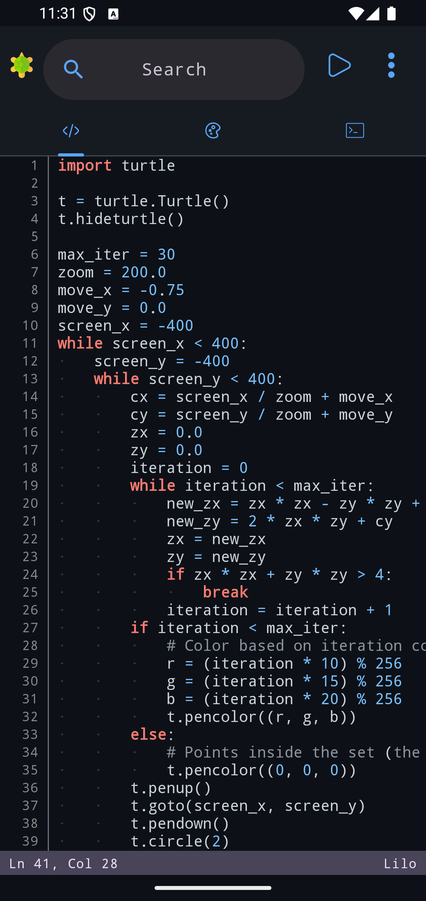
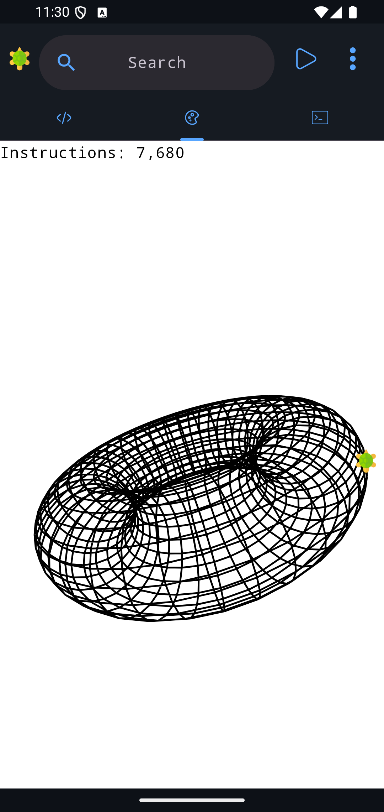
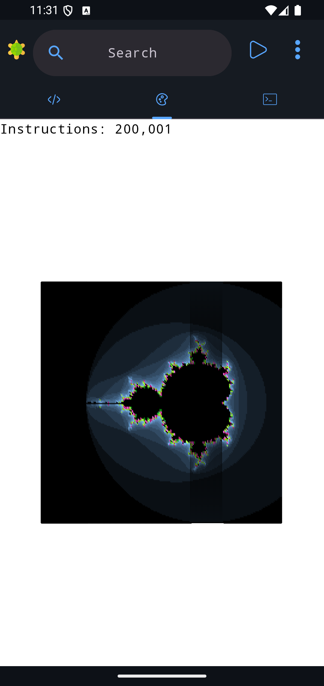

<h1 align="center">Turtle Graphics</h1>

<p align="center">
  
</p>

<p align="center">
Turtle started as a re-implementation of TurtleGraphics on Android OS with simple language, but then that simple language `Lilo`
turned into a platform with Heterogeneous Pythonic like language to practice targeting CPU & GPU in the same program
Influenced by Python, Mojo and CUDA.
</p>

# Download

<p align="center">

<a href='https://play.google.com/store/apps/details?id=com.amrdeveloper.turtle'></a>
<a href='https://github.com/AmrDeveloper/Turtle/releases'></a>
<a href='https://apt.izzysoft.de/packages/com.amrdeveloper.turtle'>
</a>
</p>

## Screenshots

<p align="center">
  
  
  
</p>

<p align="center">
  
  
  
</p>

## GPU Sample

```py
from gpu import (
    gpu,
    Dim,
)

@gpu
def vec_add(a, b, out c):
  i = gpu.block_dim.x * gpu.block_idx.x + gpu.thread_idx.x
  c[i] = a[i] + b[i]

a = [1.0, 2.0, 3.0, 4.0]
b = [5.0, 6.0, 7.0, 8.0]
c = [0.0, 0.0, 0.0, 0.0]

blocks = Dim(1, 1, 1)
threads = Dim(4, 1, 1)
vec_add[blocks, threads](a, b, c)
print("Output: ", c)
```

## Features
- Free And open source with no ads or data collecting.
- Python implementation from scratch that support GPU Programming with user-friendly error messages.
- Supports most of Python stdlib modules.
- Preview custom view for turtle graphics execution.
- Shipped with a lot of examples to learn how to use GPU, Turtle and Python features.

### License
```
MIT License

Copyright (c) 2022 - Present Amr Hesham

Permission is hereby granted, free of charge, to any person obtaining a copy
of this software and associated documentation files (the "Software"), to deal
in the Software without restriction, including without limitation the rights
to use, copy, modify, merge, publish, distribute, sublicense, and/or sell
copies of the Software, and to permit persons to whom the Software is
furnished to do so, subject to the following conditions:

The above copyright notice and this permission notice shall be included in all
copies or substantial portions of the Software.

THE SOFTWARE IS PROVIDED "AS IS", WITHOUT WARRANTY OF ANY KIND, EXPRESS OR
IMPLIED, INCLUDING BUT NOT LIMITED TO THE WARRANTIES OF MERCHANTABILITY,
FITNESS FOR A PARTICULAR PURPOSE AND NONINFRINGEMENT. IN NO EVENT SHALL THE
AUTHORS OR COPYRIGHT HOLDERS BE LIABLE FOR ANY CLAIM, DAMAGES OR OTHER
LIABILITY, WHETHER IN AN ACTION OF CONTRACT, TORT OR OTHERWISE, ARISING FROM,
OUT OF OR IN CONNECTION WITH THE SOFTWARE OR THE USE OR OTHER DEALINGS IN THE
SOFTWARE.
```
