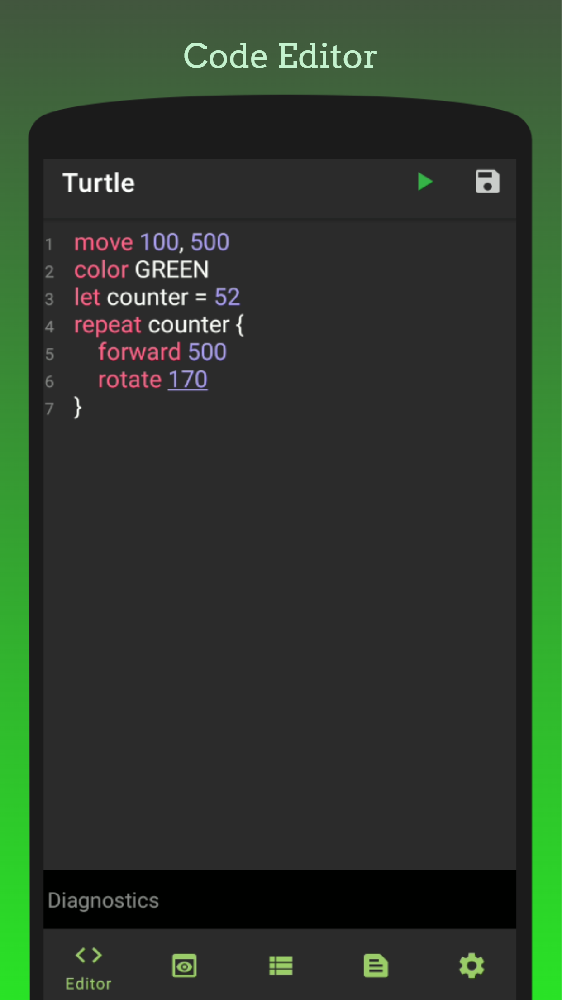
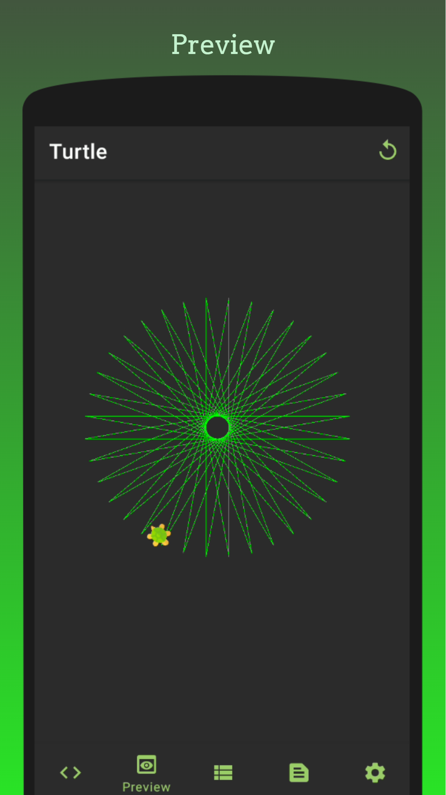
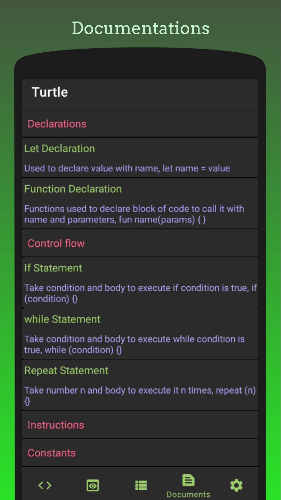

# Turtle Graphics


# Download

<a href='https://play.google.com/store/apps/details?id=com.amrdeveloper.turtle'></a>
<a href="https://www.amazon.com/dp/B0B5NN3Q4"></a>
<a href="https://galaxystore.samsung.com/detail/com.amrdeveloper.turtle"></a>
<a href="https://appgallery.huawei.com/#/app/C106630055"></a>

Turtle is an Android Application inspired from the original Turtle Graphics and Logo, Logo is an educational programming language designed in 1967 by Computer scientists Wally Feurzeig, Seymour Papert, and Cynthia Solomon and it known for its use of turtle graphics,
this project has a simple tree walking interpreted language called Lilo (Inspired from Logo too :D), with declarations statements, control flow, collections, and instructions for control the turtle in 2D Space which is our case a custom Android Canvas View and also control colors

## Screenshots

<p align="center">
  
  
  
</p>

## Features
- Free And open source with no ads.
- Full Text Editor that support auto complete, snippets, highlighter for Lilo.
- Clear diagnostics messages with line number and column position.
- Supports Lexer, Parser errors and Runtime exceptions
- Preview custom view with turtle that show the current direction.
- Full documentation view that teach you how to write your script.
- Save and Update your current script into packages with name.

## Declarations

- Let Declaration to declare variables

```
let c = BLACK
```

- Function Declaration to declare function with 0 or more parameters

```
fun f1 (n) {
   return n * 2
}

fun f2 {}

fun f3 (n) = n * 2

fun f4 = 1000
```

## Control flow

- If statement to execute block if the condition is true

```
if condition {}
elif condition2 {}
elif condition3 {}
else {}
```

- Repeat statement to execute block n times

```
repeat n {

}
```

- While statement to execute block while the condition is true

```
while condition {

}
```
- Speed statement, take time in ms to wait before each next instruction

```
speed 100
```

- Sleep statement, take time in ms to wait before the next instruction

```
sleep 100
```

- Stop statement, to stop the current execution

```
stop
```

## Collections

- List to collect values

```
let colors = [RED, BLUE, WHITE]
```

- Access list element by index

```
color colors[0]
```

- Update list element

```
colors[0] = YELLOW
```

## Movement instructions

- Rotate used to add value to the current turtle pointer degree

```
rotate 90
```

- Forward used to move forward n space

```
forward 90
```

- Backward used to rotate and move backward n space

```
backward 90
```

- Right used to rotate and move right n space

```
right 90
```

- Left used to rotate and move Left n space

```
left 90
```

## Drawing Instructions

- Circle used to draw circle around the current position with radius r

```
circle 50
```

- Cube used to draw Cube around the current position with value v

```
cube 50
```

## Coloring instructions

- Color Instruction to change the current color

```
color BLUE
```

### License
```
MIT License

Copyright (c) 2022 Amr Hesham

Permission is hereby granted, free of charge, to any person obtaining a copy
of this software and associated documentation files (the "Software"), to deal
in the Software without restriction, including without limitation the rights
to use, copy, modify, merge, publish, distribute, sublicense, and/or sell
copies of the Software, and to permit persons to whom the Software is
furnished to do so, subject to the following conditions:

The above copyright notice and this permission notice shall be included in all
copies or substantial portions of the Software.

THE SOFTWARE IS PROVIDED "AS IS", WITHOUT WARRANTY OF ANY KIND, EXPRESS OR
IMPLIED, INCLUDING BUT NOT LIMITED TO THE WARRANTIES OF MERCHANTABILITY,
FITNESS FOR A PARTICULAR PURPOSE AND NONINFRINGEMENT. IN NO EVENT SHALL THE
AUTHORS OR COPYRIGHT HOLDERS BE LIABLE FOR ANY CLAIM, DAMAGES OR OTHER
LIABILITY, WHETHER IN AN ACTION OF CONTRACT, TORT OR OTHERWISE, ARISING FROM,
OUT OF OR IN CONNECTION WITH THE SOFTWARE OR THE USE OR OTHER DEALINGS IN THE
SOFTWARE.
```